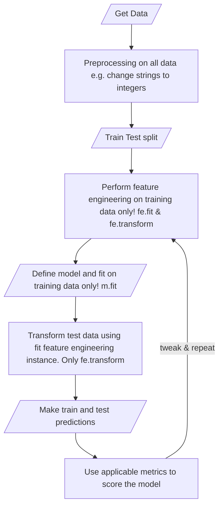

## ML workshop

1. What is machine learning? 
2. Supervised vs Unsupervised 
3. When to use which model
4. What is the ML lifecycle?
5. Examples

### High level model creation flow chart

- There are many more details but this is a good workflow to follow:

### With production and live models:

