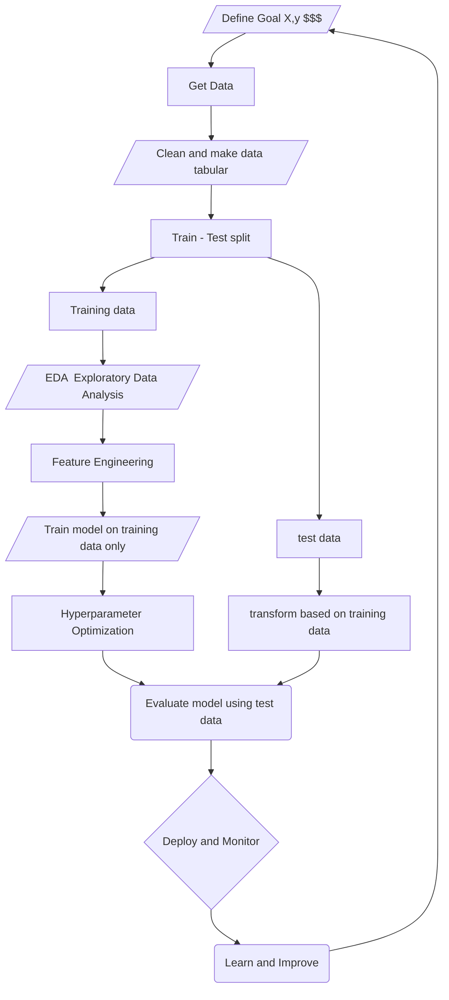
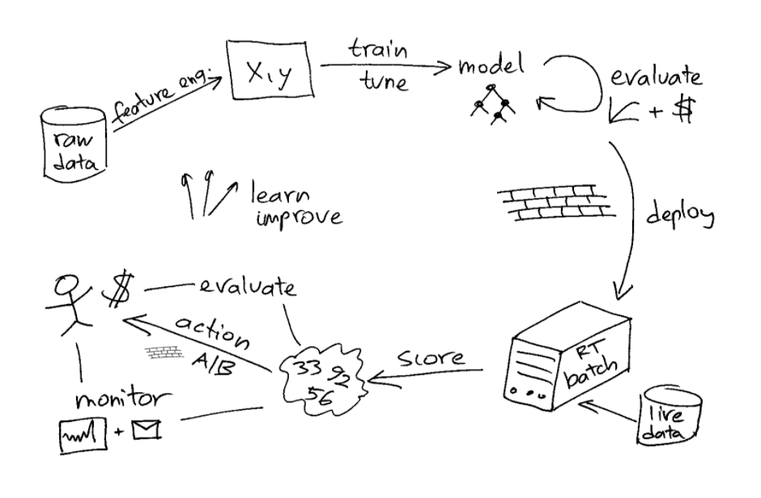

## ML workshop

1. What is machine learning? 
2. Supervised vs Unsupervised 
3. When to use which model
4. What is the ML lifecycle?
5. Examples
6. MLFlow

### High level model creation flow chart

